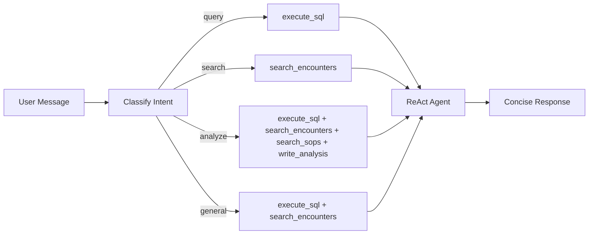
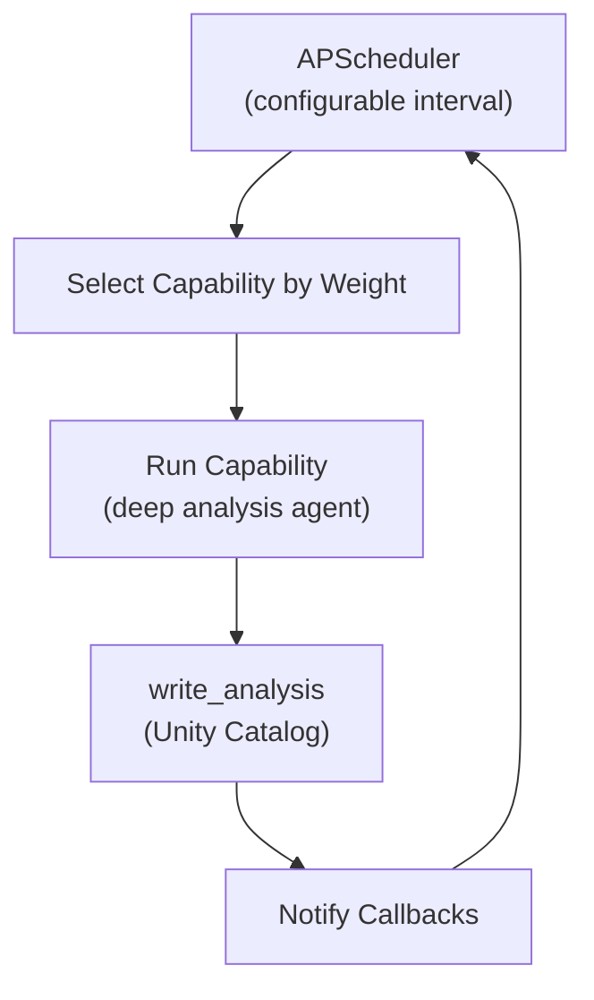

# MedOps NBA - Next Best Action for Medical Logistics

An intelligent companion for hospital operations that feels like a wise colleague, not a dashboard.

## Architecture

```
                     User Interaction
                            |
                            v
+------------------------------------------------------------------+
|                      React Frontend                               |
|   Conversation-first UI with contextual cards                     |
|   [Quick Query] [Deep Analysis] modes + Autonomous status         |
+------------------------------------------------------------------+
                            |
                            v
+------------------------------------------------------------------+
|                      Flask Server                                 |
|   /api/agent/chat, /api/autonomous/*, /api/health/score           |
+------------------------------------------------------------------+
                            |
          +-----------------+-----------------+
          |                 |                 |
          v                 v                 v
+------------------+ +---------------+ +------------------+
|  LangGraph Agent | |  Autonomous   | |   Data APIs      |
|  Quick/Deep modes| |  Scheduler    | |   Health, Alerts |
+------------------+ +---------------+ +------------------+
          |                 |                 |
          +-----------------+-----------------+
                            |
                            v
+------------------------------------------------------------------+
|                    Databricks Platform                            |
|   Unity Catalog | Vector Search | Foundation Models | MLflow      |
+------------------------------------------------------------------+
```

## Agent Modes

### Quick Query (Orchestrator)
Fast, focused answers. Pre-selects relevant tools based on your question.
- "What's the average LOS at Hospital A?" -> SQL query
- "Find similar encounters" -> Vector search
- Suggests Deep Analysis mode for complex questions
- Response in 2-5 seconds



### Deep Analysis (Multi-Agent)
Multi-agent graph with LLM supervisor, streaming progress to the UI via SSE.


**Sub-agents:**
- **Supervisor** -- LLM-based router deciding the next step (CLARIFY / PLAN / RETRIEVE / ANALYZE / RESPOND)
- **Planner** -- Assesses data needs, identifies prerequisite gaps, produces a numbered data-gathering plan
- **Retrieval** -- ReAct agent with all data tools (SQL, vector search, SOP lookup, cost/LOS/ED/staffing analyzers)
- **Analyst** -- Interprets evidence, produces structured report with citations and impact, saves via `write_analysis`

### Autonomous Mode
Background agent that continuously monitors and generates actionable reports.



**Capabilities:**
- **Drug Cost Monitoring** (20%) - Monitors drug costs, flags spikes, identifies high-cost drivers
- **LOS Analysis** (25%) - Analyzes length of stay patterns, Monday discharge effect, department benchmarks
- **ED Performance** (15%) - Monitors wait times by acuity, threshold breaches
- **Staffing Optimization** (15%) - Contract labor analysis, cost differential, recruitment ROI
- **Next Best Action Report** (20%) - Synthesizes findings into prioritized sign-off ready actions
- **Compliance Monitoring** (5%) - KPIs against accreditation thresholds

All recommendations are SOP-grounded.

## Data Model

5 core tables + 1 derived view:

```
dim_encounters (patient encounter metadata)
    |
    +-- fact_drug_costs (drug/pharmacy costs per encounter)
    |
    +-- fact_staffing (staffing levels by type: full_time, contract, per_diem)
    |
    +-- fact_ed_wait_times (ED wait time events by acuity)
    |
    +-- fact_operational_kpis (daily KPIs per hospital/department)

hospital_overview (VIEW - derived from dim_encounters)
```

**Application tables** (Lakebase with Unity Catalog fallback):
- `analysis_outputs` - Agent insights, recommendations, sign-off status

## Target Questions

The data model is designed to answer questions like:
- Why did drug costs spike in November for Hospital A?
- What specific actions can I take to reduce LOS in Hospital A?
- Why is LOS higher for patients discharged on Mondays?
- How can I reduce wait times in the Emergency Department?
- How can I lower the use of contract labor in the cardiology department?

## Health Score

A composite score (0-100) calculated from:
- 40% - Average length of stay (target: <5 days)
- 30% - Readmission rate (target: <10%)
- 30% - ED wait time breaches

## Quick Start

### 1. Prerequisites
- Databricks workspace with Unity Catalog
- SQL Warehouse
- (Optional) Lakebase instance for transactional tables

### 2. Generate Data
```bash
databricks bundle run generate_data \
  --params encounter_count=10000 \
  --params months_back=12
```

See [`notebooks/00_generate_data.py`](notebooks/00_generate_data.py)

### 3. Deploy
```bash
cd medical_logistics_nba_app
./deploy.sh dev
```

### 4. Access
The app URL will be shown in your Databricks workspace under Apps.

## Configuration

Environment variables in `app/app.yaml`:

- `CATALOG` - Unity Catalog name
- `SCHEMA` - Schema containing tables (default: `med_logistics_nba`)
- `DATABRICKS_WAREHOUSE_ID` - SQL Warehouse ID
- `LLM_MODEL_RAG` - Foundation model (default: `databricks-claude-sonnet-4-5`)
- `AUTONOMOUS_INTERVAL_SECONDS` - How often autonomous mode runs (default: 60)
- `MLFLOW_EXPERIMENT` - MLflow experiment path for tracing
- `LAKEBASE_HOST` - (Optional) Lakebase hostname
- `LAKEBASE_DATABASE` - (Optional) Lakebase database name

See [`docs/LAKEBASE_SETUP.md`](docs/LAKEBASE_SETUP.md) for Lakebase configuration.

## API Endpoints

- `POST /api/agent/chat` - Chat with agent
- `GET /api/autonomous/status` - Autonomous mode status
- `POST /api/autonomous/start` - Start autonomous mode
- `POST /api/autonomous/stop` - Stop autonomous mode
- `PATCH /api/autonomous/config` - Configure interval, capabilities
- `GET /api/health/score` - Composite health score
- `GET /api/alerts/active` - Active alerts
- `GET /api/encounters/summary` - Encounter summary stats
- `GET /api/encounters/timeline` - Encounters by day
- `GET /api/encounters/readmissions` - Recent readmissions
- `GET /api/recommendations/pending` - Pending sign-off items
- `POST /api/recommendations/:id/approve` - Approve recommendation
- `POST /api/recommendations/:id/reject` - Reject recommendation

## License

Internal use. See your organization's policies.
