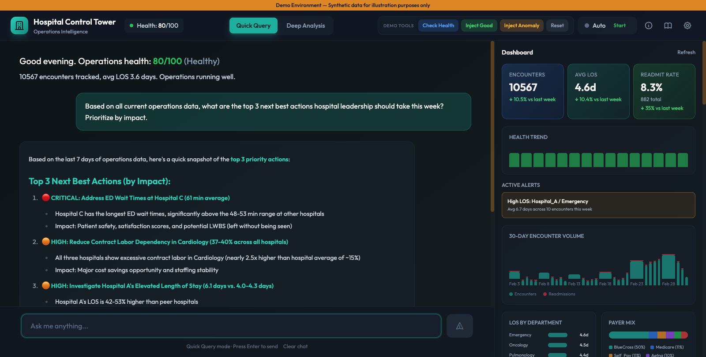
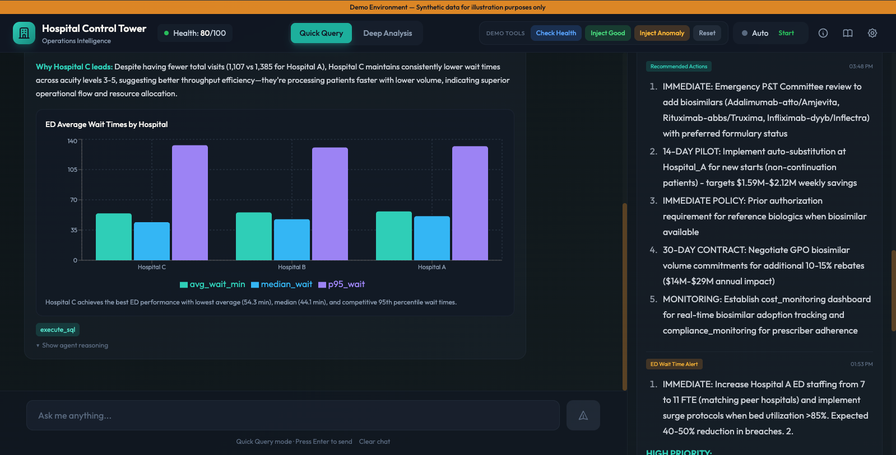
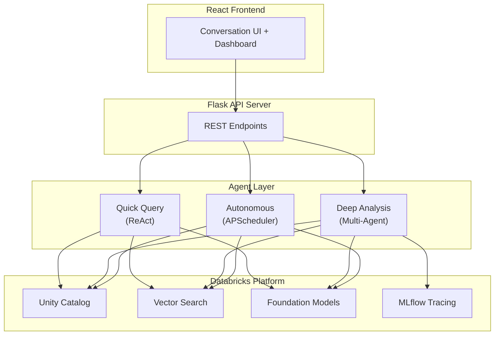
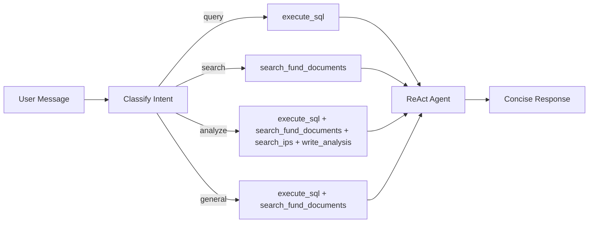
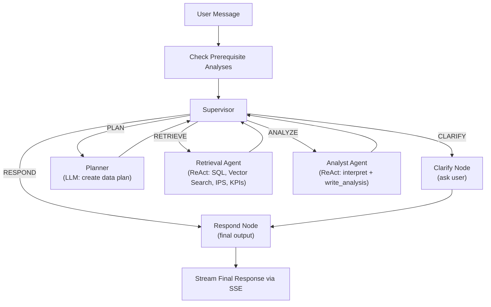
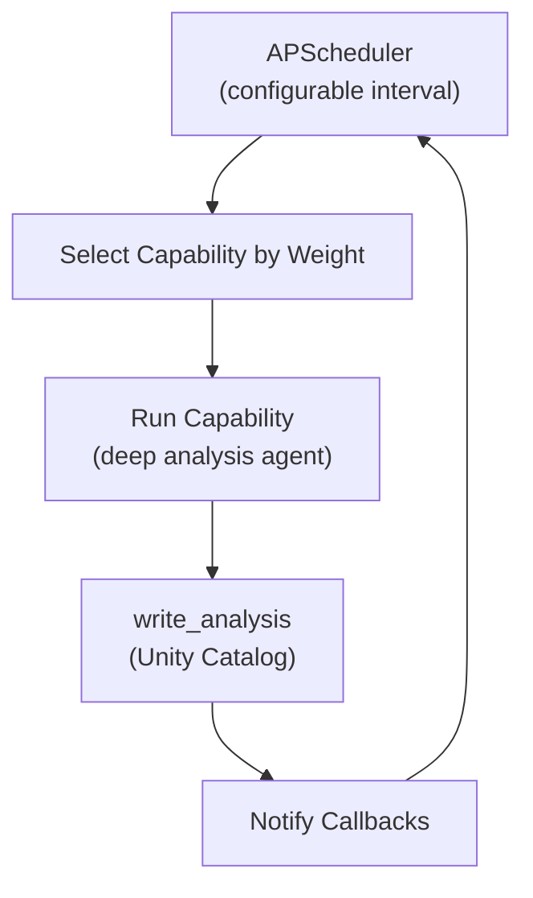

# Investment Intelligence Platform

AI-powered portfolio intelligence for investment operations on Databricks.

> **Disclaimer**: This is a Databricks Solution Accelerator -- a starting point to accelerate your project. Investment Intelligence Platform is fully functioning end-to-end, but you should evaluate, test, and modify this code for your specific use case. Agent recommendations and analytics will vary depending on your data and configuration.

## What This Is

A deployable Databricks App that gives portfolio managers a conversational AI companion. Ask questions about fund investments, performance, capital flows, and exposure -- the agent queries your data, searches Investment Policy Statements (IPS), and recommends actions grounded in your IPS.

The app shows:
- A **real-time dashboard** with composite portfolio score, fund trends, alerts, and operational metrics
- A **chat interface** with two modes: Quick Query (2-5s lookups) and Deep Analysis (30-90s multi-agent investigations)
- **Autonomous monitoring** that detects portfolio issues and generates recommended action reports in the background

**Example questions the agent can answer:**
- Why did fund performance spike in November for Manager A?
- What specific actions can I take to reduce concentration in Manager A?
- Why is performance lower for funds rebalanced on Mondays?
- How can I improve capital flow efficiency?
- How can I reduce exposure concentration in the growth strategy?

## Screenshots





## Quickstart

### Option 1: One-Command Setup (Recommended)

1. **Configure variables**:

   Edit `variables.yml` with your catalog, schema, and warehouse ID. Update the `workspace.host` in `databricks.yml` for your workspace.

   ```yaml
   # variables.yml
   catalog:
     default: "your_catalog"
   schema:
     default: "med_logistics_nba"
   warehouse_id:
     default: "your_warehouse_id"
   ```

2. **Run setup**:
   ```bash
   ./setup.sh dev
   ```
   This syncs `app/app.yaml` from `variables.yml`, deploys the bundle, generates data, grants permissions, sets up vector search and IPS documents, and runs diagnostics.

   To redeploy without regenerating data:
   ```bash
   ./setup.sh dev --skip-data
   ```

3. **Access**: Open your Databricks workspace > **Apps** > `dev-investment-intelligence-platform`.

### Option 2: Git Folder (No CLI)

1. Clone this repository into a Databricks Git Folder
2. Run notebooks in order: `00_generate_data.py` -> `01_setup_lakebase.py` -> `02_setup_vector_search.py` -> `03_grant_permissions.py` -> `05_setup_sop_vector_search.py`
3. Edit `app/app.yaml` with your catalog, schema, warehouse ID, and vector search endpoint
4. Deploy the app from the Databricks Apps UI, pointing to `app/` with `app.yaml` as the configuration

## Prerequisites

| Tool | Minimum Version | Purpose |
|------|----------------|---------|
| [Databricks CLI](https://docs.databricks.com/dev-tools/cli/install.html) | >= 0.234.0 | Bundle deployment and job management |
| [Node.js / npm](https://nodejs.org/) | >= 18 | Frontend build (React + Vite) |
| Python | >= 3.10 | Backend and notebooks |
| [jq](https://jqlang.github.io/jq/) | any (optional) | Reliable JSON parsing in `deploy.sh` |

You also need:
- A **Databricks workspace** with Unity Catalog enabled
- A **SQL Warehouse** -- set the ID in `variables.yml` (`warehouse_id`)
- A **Vector Search endpoint** -- created automatically by `02_setup_vector_search.py`, or provide an existing one in `variables.yml`
- (Optional) A **Lakebase instance** for transactional storage -- see [`docs/LAKEBASE_SETUP.md`](docs/LAKEBASE_SETUP.md)

## Architecture

<details>
<summary>Architecture diagram</summary>


</details>

## Agent Modes

### Quick Query
Fast ReAct agent with intent classification. Classifies your question (data lookup, search, analysis) and selects the right tools. Responds in 2-5 seconds.

<details>
<summary>Architecture diagram</summary>


</details>

### Deep Analysis
Multi-agent LangGraph graph with LLM supervisor. Streams progress via SSE. The supervisor routes between planning, retrieval, analysis, and clarification nodes. Responds in 30-90 seconds with structured reports, evidence citations, and IPS-grounded recommendations.

<details>
<summary>Architecture diagram</summary>


</details>

### Autonomous Mode
Background agent (APScheduler) that monitors portfolio health and generates recommended action reports only when issues are detected. Configurable interval, auto-stops after 2 hours.

<details>
<summary>Architecture diagram</summary>


</details>

## Data Model

5 core tables + 1 derived view, all generated synthetically with built-in patterns for the agent to discover:

```
dim_funds (fund investment metadata)
    |
    +-- fact_performance (fund performance metrics per investment)
    |
    +-- fact_holdings (portfolio holdings by type: equity, fixed_income, alternatives)
    |
    +-- fact_capital_flows (capital flow events by type)
    |
    +-- fact_operational_kpis (daily KPIs per manager/strategy)

manager_overview (VIEW - derived from dim_funds)
```

**Portfolio Score**: Composite 0-100 score from: 40% avg performance (target) + 30% watchlist rate (target <10%) + 30% flow breaches.

## Notebooks

| Notebook | Description |
|----------|-------------|
| `00_generate_data.py` | Generate synthetic portfolio data (funds, performance, holdings, flows, KPIs). Supports `overwrite` and `append` modes. |
| `01_setup_lakebase.py` | Configure Lakebase instance and `analysis_outputs` table |
| `02_setup_vector_search.py` | Create Vector Search endpoint and fund document similarity index |
| `03_grant_permissions.py` | Grant Unity Catalog permissions to the app service principal |
| `04_diagnostic_check.py` | Validate all prerequisites (tables, indexes, endpoints, permissions) |
| `05_setup_sop_vector_search.py` | Parse IPS documents and create IPS vector search index |
| `06_simplify_data_model.py` | Setup and refresh the data model tables and views |
| `07_generate_batches.py` | Generate incremental data batches for testing |
| `08_setup_lakebase_migrations.py` | Run Alembic migrations for Lakebase schema |

## Configuration

Environment variables in `app/app.yaml` (auto-generated by `setup.sh` from `variables.yml`):

| Variable | Description | Default |
|----------|-------------|---------|
| `CATALOG` | Unity Catalog name | -- |
| `SCHEMA` | Schema containing tables | `med_logistics_nba` |
| `DATABRICKS_WAREHOUSE_ID` | SQL Warehouse ID | -- |
| `VECTOR_SEARCH_ENDPOINT` | Vector Search endpoint name | -- |
| `LLM_MODEL_ORCHESTRATOR` | Foundation model for quick query | `databricks-claude-sonnet-4-5` |
| `LLM_MODEL_RAG` | Foundation model for deep analysis / RAG | `databricks-claude-sonnet-4-5` |
| `AUTONOMOUS_INTERVAL_SECONDS` | How often autonomous mode checks (seconds) | `3600` |
| `AUTO_START_AUTONOMOUS` | Start autonomous mode on app boot | `false` |

## Project Structure

```
medical_logistics_nba_app/
  setup.sh                    # One-command setup (recommended entry point)
  deploy.sh                   # Deploy steps called by setup.sh (permissions, vector search, diagnostics)
  databricks.yml              # DAB config (dev + prod targets)
  variables.yml               # Bundle variables (catalog, schema, warehouse, models)
  app/                        # Databricks App (Flask + React)
    api_server.py             #   Flask API server with REST + SSE endpoints
    app.yaml                  #   App config (auto-generated by setup.sh from variables.yml)
    agent/                    #   Agent implementations
      config.py               #     Centralized configuration (env vars, table names, constants)
      orchestrator.py         #     Quick Query mode (ReAct with intent classification)
      graph.py                #     Deep Analysis mode (multi-agent LangGraph StateGraph)
      autonomous.py           #     Autonomous mode (APScheduler + smart health check)
      tools.py                #     Shared agent tools (SQL, vector search, IPS, KPI)
    src/                      #   React frontend (Vite + Tailwind)
      App.jsx                 #     Main app component
      components/             #     UI components (Header, Chat, Dashboard, DemoGuide, Settings)
  src/                        # Shared Python source (mirrored for notebooks)
    agent/                    #   Agent code (graph, orchestrator, tools)
  notebooks/                  # Databricks notebooks (see table above)
  resources/                  # DAB resource definitions (jobs.yml, apps.yml)
  data/                       # Sample data
    sop_samples/              #   Sample IPS documents for vector search
  docs/                       # Documentation
```

## Documentation

| Document | Description |
|----------|-------------|
| [`docs/BUILDING_AGENTS.md`](docs/BUILDING_AGENTS.md) | Developer guide: how the agent architecture works and how to extend it |
| [`docs/WALKTHROUGH.md`](docs/WALKTHROUGH.md) | 15-minute demo walkthrough script for presenters |
| [`docs/GAP_ANALYSIS.md`](docs/GAP_ANALYSIS.md) | Business value proposition and competitive landscape |
| [`docs/QUICK_REFERENCE.md`](docs/QUICK_REFERENCE.md) | One-page demo cheat sheet |
| [`docs/LAKEBASE_SETUP.md`](docs/LAKEBASE_SETUP.md) | Optional Lakebase configuration guide |

## Libraries

### Python Backend

| Library | Version | License | Description | PyPI |
|---------|---------|---------|-------------|------|
| flask | >= 3.0.0 | BSD-3-Clause | Lightweight WSGI web framework | [PyPI](https://pypi.org/project/Flask/) |
| flask-cors | >= 4.0.0 | MIT | Cross-Origin Resource Sharing for Flask | [PyPI](https://pypi.org/project/Flask-Cors/) |
| databricks-sdk | >= 0.20.0 | Apache 2.0 | Databricks SDK for Python | [PyPI](https://pypi.org/project/databricks-sdk/) |
| databricks-langchain | >= 0.1.0 | MIT | LangChain integration for Databricks | [PyPI](https://pypi.org/project/databricks-langchain/) |
| databricks-vectorsearch | >= 0.40 | Apache 2.0 | Databricks Vector Search client | [PyPI](https://pypi.org/project/databricks-vectorsearch/) |
| langgraph | >= 0.2.0 | MIT | Multi-agent orchestration framework | [PyPI](https://pypi.org/project/langgraph/) |
| langchain-core | >= 0.3.0 | MIT | Core LangChain abstractions | [PyPI](https://pypi.org/project/langchain-core/) |
| gunicorn | >= 21.2.0 | MIT | Python WSGI HTTP server | [PyPI](https://pypi.org/project/gunicorn/) |
| httpx | >= 0.25.0 | BSD-3-Clause | Async HTTP client | [PyPI](https://pypi.org/project/httpx/) |
| apscheduler | >= 3.10.0 | MIT | Advanced Python Scheduler | [PyPI](https://pypi.org/project/APScheduler/) |
| sqlalchemy | >= 2.0.0 | MIT | SQL toolkit and ORM | [PyPI](https://pypi.org/project/SQLAlchemy/) |
| alembic | >= 1.13.0 | MIT | Database migration tool for SQLAlchemy | [PyPI](https://pypi.org/project/alembic/) |
| psycopg2-binary | >= 2.9.0 | LGPL-3.0 | PostgreSQL adapter for Python | [PyPI](https://pypi.org/project/psycopg2-binary/) |
| mlflow | >= 3.1 | Apache 2.0 | ML lifecycle management and tracing | [PyPI](https://pypi.org/project/mlflow/) |

### Frontend

| Library | Version | License | Description | npm |
|---------|---------|---------|-------------|-----|
| react | ^18.3.1 | MIT | UI component library | [npm](https://www.npmjs.com/package/react) |
| react-dom | ^18.3.1 | MIT | React DOM renderer | [npm](https://www.npmjs.com/package/react-dom) |
| react-markdown | ^9.0.1 | MIT | Markdown renderer for React | [npm](https://www.npmjs.com/package/react-markdown) |
| tailwindcss | ^3.4.1 | MIT | Utility-first CSS framework | [npm](https://www.npmjs.com/package/tailwindcss) |
| vite | ^5.4.0 | MIT | Frontend build tool | [npm](https://www.npmjs.com/package/vite) |

### Runtime (provided by Databricks)

| Library | License | Description |
|---------|---------|-------------|
| pyspark | Apache 2.0 | Apache Spark Python API |
| dbldatagen | Apache 2.0 | Databricks Labs synthetic data generator |
| faker | MIT | Fake data generation library |

### Foundation Models

| Model | Provider | Usage |
|-------|----------|-------|
| databricks-claude-sonnet-4-5 | Anthropic (via Databricks) | Deep analysis, RAG, autonomous agent |
| databricks-gte-large-en | Databricks | Vector Search embeddings |

All application dependencies use permissive open-source licenses (MIT, Apache 2.0, BSD-3-Clause) except `psycopg2-binary` (LGPL-3.0, optional -- only used with Lakebase).

## License

[DB License](LICENSE.md)
