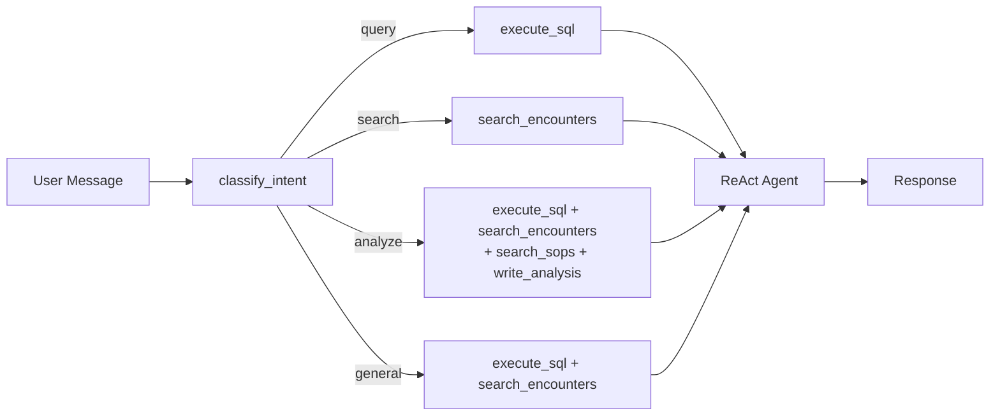
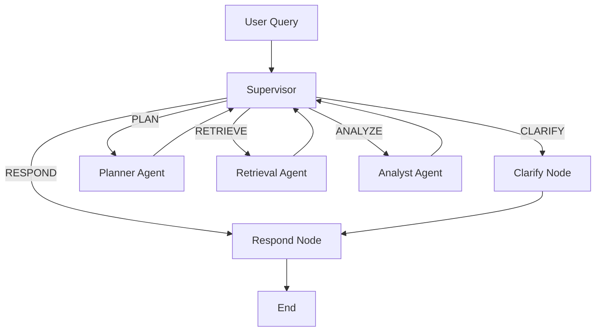
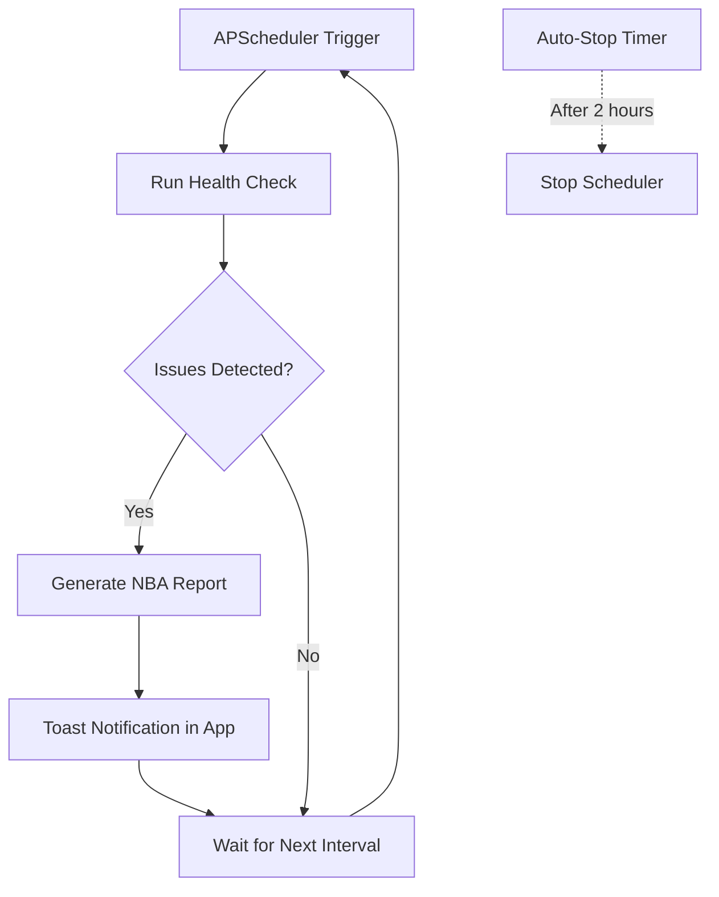

# Hospital Control Tower -- SA Education Guide

A technical explanation of the agent architectures in Hospital Control Tower, designed for presenting to customers and explaining how multi-agent systems work on Databricks.

---

## Quick Query Architecture

Quick Query uses a single ReAct agent with **dynamic tool allocation** -- the system classifies user intent before choosing which tools the agent can access.

### How Dynamic Tool Allocation Works

Before the LLM runs, `classify_intent()` pattern-matches keywords in the user's message and selects a tool subset. This means the agent starts with only the tools relevant to the task -- reducing latency and preventing irrelevant tool calls.

| Intent | Trigger Keywords | Tools Allocated | Typical Latency |
|--------|-----------------|-----------------|-----------------|
| **query** | "how many", "count", "average", "total", "show", "list" | `execute_sql` | 2-5s |
| **search** | "find", "search", "similar", "describe", "explain" | `search_encounters` | 3-6s |
| **analyze** | "analyze", "recommend", "trend", "compare", "why", "reduce", "sop" | `execute_sql`, `search_encounters`, `search_sops`, `write_analysis` | 5-15s |
| **general** | (no keyword match) | `execute_sql`, `search_encounters` | 3-8s |

**Examples:**
- "How many encounters did Hospital A have last week?" -> **query** -> `[execute_sql]` (1 tool, fast lookup)
- "Find patients similar to encounter ENC_001" -> **search** -> `[search_encounters]` (vector similarity)
- "Why is readmission rate high and what can we do?" -> **analyze** -> 4 tools (SQL + vector search + SOP lookup + write)

### Talking Points

> "Quick Query demonstrates dynamic tool allocation -- the system reads the user's intent and pre-selects only the relevant tools. A simple 'how many' question only gets SQL access, so it responds in 2-3 seconds. An analysis request gets the full tool suite. This is more efficient than giving every agent every tool."

> "Under the hood this is a LangChain ReAct agent running on Databricks Foundation Models. Each tool call is a function that executes SQL, queries Vector Search, or searches SOP documents -- all governed by Unity Catalog."

---

## Deep Analysis Architecture

Deep Analysis uses a **multi-agent supervisor graph** built with LangGraph. An LLM supervisor decides the next step at each iteration, routing to specialized sub-agents.

### Sub-Agent Roles

| Agent | Purpose | Tools |
|-------|---------|-------|
| **Supervisor** | Routes to the right next step based on current state | None (LLM reasoning only) |
| **Planner** | Creates a numbered data-gathering plan | None (LLM reasoning only) |
| **Retrieval** | Executes the plan -- queries SQL, vector search, SOPs | `execute_sql`, `search_encounters`, `search_sops`, analysis tools |
| **Analyst** | Interprets evidence, writes structured report | `write_analysis` |
| **Clarify** | Asks user a clarifying question when query is ambiguous | None |
| **Respond** | Formats final answer with citations | None |

### Execution Flow

1. **Supervisor** examines the query and current state. If no plan exists, routes to PLAN.
2. **Planner** produces a numbered data-gathering plan (e.g., "1. Query avg LOS by dept, 2. Search SOPs for LOS reduction").
3. **Supervisor** sees a plan exists but no evidence -- routes to RETRIEVE.
4. **Retrieval Agent** (ReAct with data tools) executes each step of the plan, accumulating evidence.
5. **Supervisor** sees evidence gathered -- routes to ANALYZE.
6. **Analyst Agent** interprets the evidence, produces a structured report with citations and impact assessment.
7. **Supervisor** sees analysis complete -- routes to RESPOND.
8. **Respond** formats the final answer and terminates.

After 3 supervisor iterations, the system forces RESPOND to prevent infinite loops.

### Frontend UX

The frontend uses a **submit-then-poll** pattern:
1. POST to `/api/agent/chat` returns a `task_id` immediately
2. Frontend polls `GET /api/agent/task/{task_id}` every 2 seconds
3. Each poll returns the current stage (planning, retrieving, analyzing...)
4. When status is "done", the full response is returned

This avoids long-lived HTTP connections that can be terminated by reverse proxies.

### Talking Points

> "Deep Analysis is a multi-agent system with an LLM supervisor that decides what to do next. It can ask for clarification, plan a data investigation, dispatch a retrieval agent to gather evidence from SQL and vector search, then hand off to an analyst agent for interpretation."

> "The supervisor pattern is more flexible than a fixed chain. For simple questions it might skip planning entirely. For complex ones it can loop: gather some data, realize it needs more, and dispatch another retrieval round."

> "Every recommendation includes citations -- the retrieval agent logs which SQL queries and SOP documents it consulted, so you can trace exactly where an insight came from."

---

## Autonomous Agent Architecture

The autonomous agent runs on a configurable schedule, performs proactive health checks, and generates action reports only when issues are detected.

### Smart Execution

The autonomous agent does not blindly run all analyses. It follows a two-phase approach:

1. **Health Check** -- Runs a readiness check that queries current metrics (LOS, readmission rate, ED breaches, contract labor %). Looks for keywords like "breach", "anomal", "critical" in the results.
2. **NBA Report** -- Only if the health check flags issues, runs a full Next Best Action analysis that produces prioritized recommendations.

### Capabilities

The autonomous agent has configurable focus areas (toggled in the Settings panel):

| Capability | What It Checks |
|------------|---------------|
| Length of Stay Analysis | Departments with LOS above target |
| Drug Cost Monitoring | Cost anomalies and category-level spikes |
| ED Performance | Wait time breaches and throughput |
| Staffing Optimization | Contract labor ratios |
| Recommended Actions Report | Prioritized action plan for leadership |
| Compliance Monitoring | KPI thresholds and regulatory metrics |

### Safety Features

- **Auto-stop**: Shuts down after 2 hours (configurable) to prevent runaway resource usage
- **Configurable interval**: Default 1 hour, adjustable from 1 minute to 1 day
- **Single instance**: APScheduler prevents overlapping runs
- **Manual trigger**: "Check Health" button runs an immediate check without waiting for the schedule

### Talking Points

> "The autonomous agent is proactive -- it doesn't wait for someone to ask a question. Every hour it checks operational health, and only when it finds issues does it generate an action report. This is the 'control tower' concept: continuous monitoring with intelligent escalation."

> "It uses the same Deep Analysis multi-agent graph under the hood, so recommendations are evidence-based and SOP-grounded -- not generic."

> "For demos, it auto-stops after 2 hours. In production you'd remove that limit and integrate with alerting systems."

---

## Platform Architecture

All components run on Databricks:

| Component | Databricks Service |
|-----------|-------------------|
| Data storage (encounters, costs, staffing) | Unity Catalog Delta tables |
| SOP document retrieval | Vector Search with GTE embeddings |
| LLM reasoning | Foundation Models (Claude Sonnet, GPT) |
| Agent tracing and observability | MLflow |
| Application hosting | Databricks Apps (Flask + React) |
| Deployment automation | Databricks Asset Bundles |
| Transactional writes (optional) | Lakebase |

No external API keys or services are required. Everything is governed by Unity Catalog permissions.

---

## Presenting to Customers

### Recommended Demo Flow

1. **Start with the dashboard** -- show the health score and operational metrics. Frame the problem: "dozens of disconnected dashboards, reactive workflows."
2. **Quick Query** -- show a fast data lookup. Explain dynamic tool allocation.
3. **Deep Analysis** -- ask a complex question. While it runs, explain the supervisor graph and sub-agent roles. Point out tool calls and citations in the response.
4. **Inject Anomaly** -- show the health score drop. Explain how real-time data changes affect the system.
5. **Autonomous Mode** -- start it, trigger a manual health check. Show how it generates proactive recommendations.
6. **Architecture wrap-up** -- explain that everything runs on Databricks with no external dependencies.

### Common Customer Questions

**"How is this different from a chatbot with RAG?"**
> RAG retrieves documents and generates answers. This system also plans investigations, queries structured data via SQL, combines multiple data sources, and writes persistent analysis reports. The multi-agent supervisor graph decides the workflow dynamically.

**"Can we customize the data model?"**
> Yes. The data tables, agent prompts, and SOP documents are all configurable. The architecture is a starting point -- a customer would plug in their own Unity Catalog tables and SOPs.

**"How do you prevent hallucination?"**
> Every recommendation cites specific SQL results or SOP document sections. The analyst agent is instructed to ground all claims in retrieved evidence. The tool call log shows exactly what data was consulted.

**"What about cost and latency?"**
> Quick Query: 2-5 seconds, 1-2 LLM calls. Deep Analysis: 30-90 seconds, 6-10 LLM calls. Autonomous: runs on a schedule (hourly default), only generates reports when needed. All LLM calls use pay-per-token Foundation Models.
